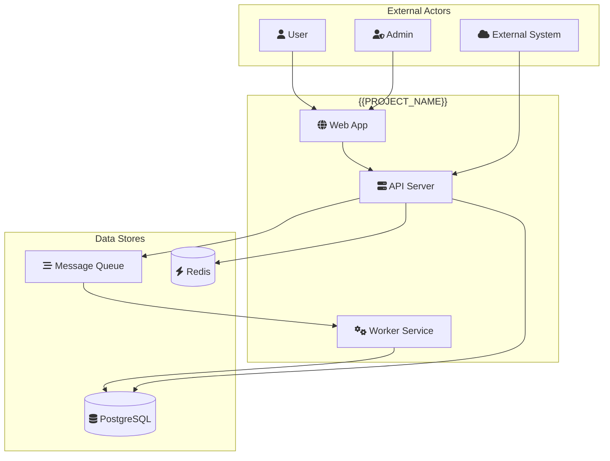
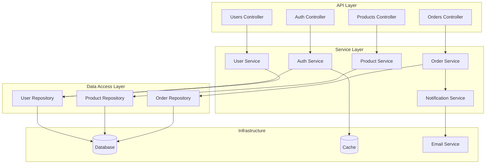
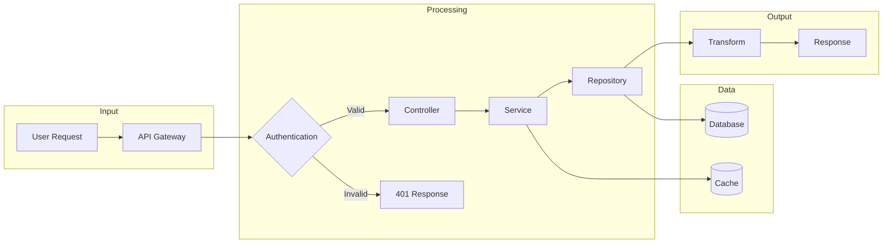
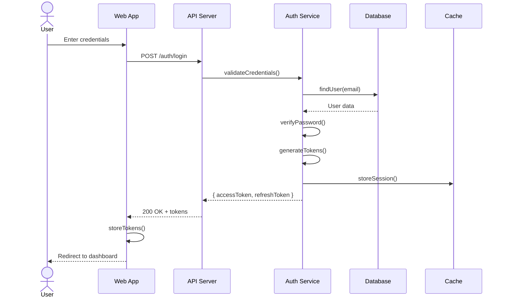
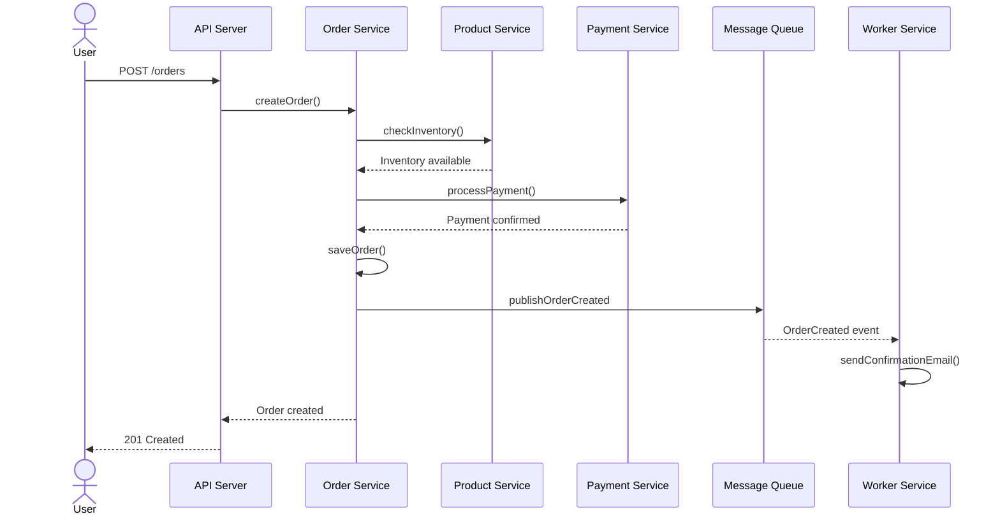
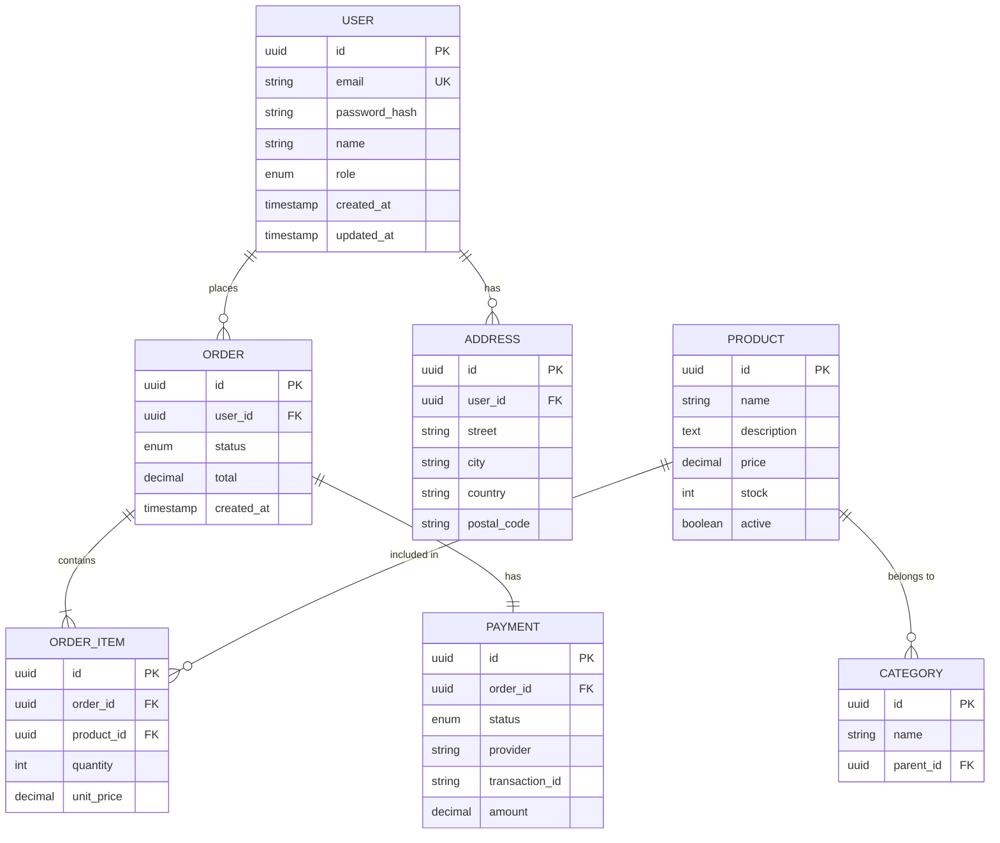
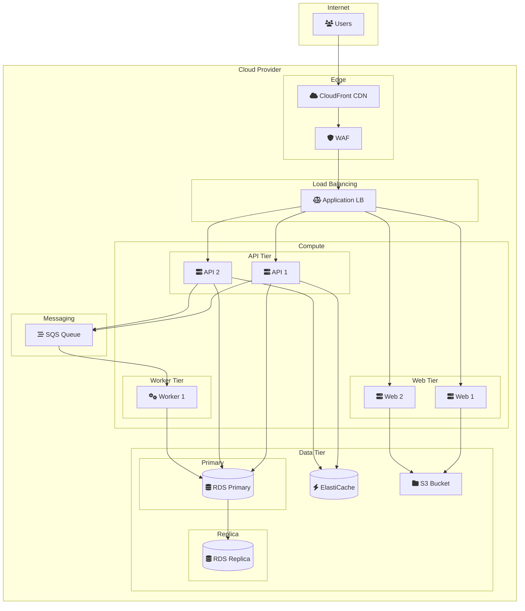
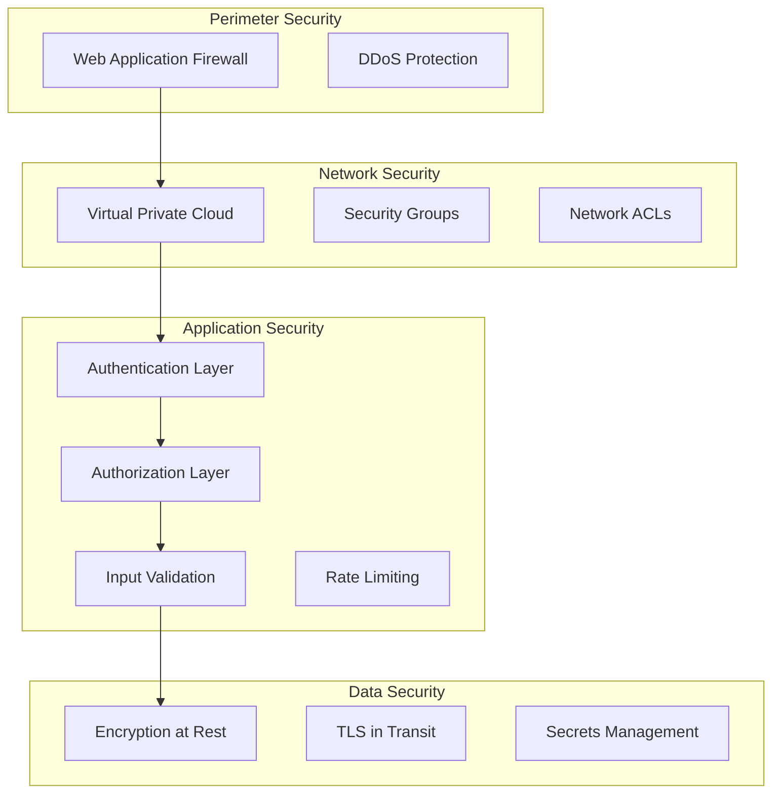

# Architecture Documentation Agent (DOC03)

Generate comprehensive architecture documentation including system diagrams, data flows, and architectural decision records (ADRs).

---

## 1. System Analysis

### 1.1 Identify System Components

**Search for main components:**
```
Glob: src/*, apps/*, packages/*, services/*, lib/*
Grep: @Controller|@Service|@Module|class.*Service|class.*Controller|def.*view
```

**Component categories to identify:**
- [ ] Entry points (main, index, app)
- [ ] Controllers/Handlers (API layer)
- [ ] Services (business logic)
- [ ] Repositories (data access)
- [ ] Models/Entities (domain objects)
- [ ] Utilities/Helpers
- [ ] Middleware
- [ ] Guards/Interceptors

### 1.2 Identify External Dependencies

**Search for external integrations:**
```
Grep: fetch\(|axios|HttpClient|requests\.|http\.Get|@InjectConnection|createClient
Glob: **/*.ts, **/*.py, **/*.go
```

**External systems to identify:**
- [ ] Databases (PostgreSQL, MongoDB, Redis)
- [ ] Message queues (RabbitMQ, Kafka, SQS)
- [ ] External APIs (Stripe, Twilio, AWS)
- [ ] Authentication providers (Auth0, Cognito)
- [ ] Storage services (S3, GCS)
- [ ] CDN services
- [ ] Monitoring/Logging services

### 1.3 Analyze Module Structure

**For monorepo projects:**
```
Glob: packages/*/package.json, apps/*/package.json
Grep: "name"|"dependencies"
```

**For monolithic projects:**
```
Glob: src/*/index.ts, src/*/*.module.ts
Grep: @Module|imports:|exports:
```

**Document module relationships:**
- [ ] Module boundaries
- [ ] Import/export relationships
- [ ] Shared dependencies
- [ ] Module responsibilities

---

## 2. Diagram Generation

### 2.1 System Overview Diagram

**Generate high-level system context diagram:**



**Guidelines for system diagram:**
- Show all external actors (users, admin, other systems)
- Group internal components logically
- Show data stores separately
- Include async communication (queues)
- Use Font Awesome icons for clarity

### 2.2 Component Diagram

**Generate detailed component diagram:**



### 2.3 Data Flow Diagram

**Generate data flow for key processes:**



### 2.4 Sequence Diagrams

**Generate sequence diagrams for key flows:**

**User Authentication Flow:**


**Order Creation Flow:**


### 2.5 Entity Relationship Diagram

**Generate ER diagram from models:**



### 2.6 Deployment Architecture

**Generate deployment diagram:**



---

## 3. Architectural Decision Records (ADRs)

### 3.1 ADR Template

```markdown
# ADR-{{NUMBER}}: {{TITLE}}

## Status

{{STATUS: Proposed | Accepted | Deprecated | Superseded}}

## Context

{{CONTEXT: What is the issue that we're seeing that is motivating this decision?}}

## Decision

{{DECISION: What is the change that we're proposing and/or doing?}}

## Consequences

### Positive
- {{POSITIVE_CONSEQUENCE_1}}
- {{POSITIVE_CONSEQUENCE_2}}

### Negative
- {{NEGATIVE_CONSEQUENCE_1}}
- {{NEGATIVE_CONSEQUENCE_2}}

### Neutral
- {{NEUTRAL_CONSEQUENCE}}

## Alternatives Considered

### Alternative 1: {{ALTERNATIVE_NAME}}
- Description: {{DESCRIPTION}}
- Pros: {{PROS}}
- Cons: {{CONS}}
- Why not chosen: {{REASON}}

## References

- {{REFERENCE_LINK}}
```

### 3.2 Generate ADRs from Analysis

**Analyze code for technology decisions:**

**Database Choice:**
```
Grep: postgres|mysql|mongodb|sqlite|typeorm|prisma|mongoose|sqlalchemy
Glob: package.json, requirements.txt, **/config/*.ts
```

**Framework Choice:**
```
Grep: nestjs|express|fastify|django|flask|fastapi|gin|echo|spring
```

**Authentication Approach:**
```
Grep: passport|jwt|oauth|session|auth0|cognito
```

**Generate ADRs for detected decisions:**

```markdown
# ADR-001: Use PostgreSQL as Primary Database

## Status
Accepted

## Context
We need a reliable, scalable database that supports complex queries, transactions, and has strong data integrity guarantees.

## Decision
We will use PostgreSQL as our primary database with TypeORM as the ORM layer.

## Consequences

### Positive
- ACID compliance ensures data integrity
- Rich query capabilities with JSON support
- Excellent TypeORM integration
- Strong community and tooling

### Negative
- More complex than NoSQL for simple use cases
- Requires schema migrations
- Horizontal scaling requires additional tools

## Alternatives Considered

### MongoDB
- Pros: Flexible schema, easy horizontal scaling
- Cons: Eventual consistency, less mature transactions
- Why not chosen: Strong consistency requirements

### MySQL
- Pros: Wide adoption, good performance
- Cons: Less feature-rich than PostgreSQL
- Why not chosen: PostgreSQL's JSON and advanced features preferred
```

---

## 4. Integration Points Documentation

### 4.1 Internal Integration Points

**Search for internal service communication:**
```
Grep: inject|@Inject|import.*from.*service|from.*repository
Glob: **/*.service.ts, **/*.controller.ts
```

**Document integration points:**
```markdown
## Internal Service Integration

### User Service
**Consumed by:** Auth Service, Order Service, Notification Service
**Provides:**
- User CRUD operations
- Profile management
- Role/permission checking

**Communication:** Direct injection (synchronous)

### Notification Service
**Consumed by:** Order Service, Auth Service
**Provides:**
- Email sending
- Push notifications
- SMS messaging

**Communication:** Message queue (asynchronous)
```

### 4.2 External Integration Points

**Search for external API calls:**
```
Grep: fetch|axios|HttpService|requests\.|http\.Client
Glob: **/*.ts, **/*.py, **/*.go
```

**Document external integrations:**
```markdown
## External Service Integration

### Stripe Payment Gateway

**Purpose:** Process payments and manage subscriptions

**Endpoints Used:**
| Endpoint | Method | Purpose |
|----------|--------|---------|
| `/v1/payment_intents` | POST | Create payment |
| `/v1/customers` | POST | Create customer |
| `/v1/subscriptions` | POST | Create subscription |

**Authentication:** API Key (secret key)

**Error Handling:**
- 402: Payment failed - show payment error to user
- 429: Rate limited - implement exponential backoff
- 5xx: Stripe error - retry with backoff

**Webhooks:**
| Event | Handler | Action |
|-------|---------|--------|
| `payment_intent.succeeded` | PaymentWebhook | Mark order as paid |
| `subscription.updated` | SubscriptionWebhook | Update user subscription |

### AWS S3

**Purpose:** Store user uploads and static assets

**Buckets:**
| Bucket | Purpose | Access |
|--------|---------|--------|
| `app-uploads` | User uploads | Private |
| `app-public` | Public assets | Public |

**Operations:**
- PutObject: Upload files
- GetObject: Retrieve files (signed URLs)
- DeleteObject: Remove files
```

---

## 5. Security Architecture

### 5.1 Security Layers



### 5.2 Authentication Flow

```markdown
## Authentication Architecture

### Token-Based Authentication

**Token Types:**
| Token | Lifetime | Storage | Purpose |
|-------|----------|---------|---------|
| Access Token | 15 minutes | Memory/localStorage | API authentication |
| Refresh Token | 7 days | HttpOnly cookie | Obtain new access tokens |

### Authentication Flow

1. User submits credentials
2. Server validates against database
3. Server generates JWT access token and refresh token
4. Access token returned in response body
5. Refresh token set as HttpOnly cookie
6. Client includes access token in Authorization header
7. On expiry, client uses refresh token to obtain new access token

### Security Measures

- Password hashing: bcrypt with cost factor 12
- Token signing: RS256 with rotating keys
- Session invalidation: Redis-backed blacklist
- Rate limiting: 5 failed attempts = 15 minute lockout
```

---

## 6. Technology Stack Documentation

### 6.1 Tech Stack Overview

```markdown
## Technology Stack

### Backend

| Layer | Technology | Purpose |
|-------|------------|---------|
| Runtime | Node.js 20 | JavaScript runtime |
| Framework | NestJS 10 | Application framework |
| Language | TypeScript 5 | Type-safe JavaScript |
| ORM | TypeORM | Database abstraction |
| Validation | class-validator | DTO validation |

### Frontend

| Layer | Technology | Purpose |
|-------|------------|---------|
| Framework | React 18 | UI library |
| Language | TypeScript 5 | Type-safe JavaScript |
| Styling | Tailwind CSS | Utility-first CSS |
| State | Zustand | State management |
| Forms | React Hook Form | Form handling |

### Infrastructure

| Component | Technology | Purpose |
|-----------|------------|---------|
| Container | Docker | Containerization |
| Orchestration | Kubernetes | Container orchestration |
| CI/CD | GitHub Actions | Automation |
| Monitoring | Datadog | Observability |
| Logging | CloudWatch | Log aggregation |

### Data

| Component | Technology | Purpose |
|-----------|------------|---------|
| Primary DB | PostgreSQL 15 | Relational data |
| Cache | Redis 7 | Session/cache |
| Search | Elasticsearch | Full-text search |
| Queue | RabbitMQ | Message broker |
```

---

## 7. Output Format

Generate architecture documentation following this structure:

```markdown
# {{PROJECT_NAME}} Architecture

## Overview

{{HIGH_LEVEL_DESCRIPTION}}

## System Context

{{SYSTEM_CONTEXT_DIAGRAM}}

{{EXTERNAL_SYSTEMS_DESCRIPTION}}

## Component Architecture

{{COMPONENT_DIAGRAM}}

### Components

{{COMPONENT_DESCRIPTIONS}}

## Data Architecture

### Entity Relationships

{{ER_DIAGRAM}}

### Data Flow

{{DATA_FLOW_DIAGRAM}}

## Key Workflows

### {{WORKFLOW_1_NAME}}

{{SEQUENCE_DIAGRAM_1}}

### {{WORKFLOW_2_NAME}}

{{SEQUENCE_DIAGRAM_2}}

## Deployment Architecture

{{DEPLOYMENT_DIAGRAM}}

### Environments

{{ENVIRONMENT_DETAILS}}

## Security Architecture

{{SECURITY_OVERVIEW}}

## Technology Decisions

### ADRs

{{ADR_LIST}}

## Integration Points

### Internal

{{INTERNAL_INTEGRATIONS}}

### External

{{EXTERNAL_INTEGRATIONS}}

## Appendix

### Glossary

{{GLOSSARY}}

### References

{{REFERENCES}}
```

---

## 8. Quality Checks

Before finalizing, verify:

- [ ] All Mermaid diagrams render correctly
- [ ] Diagrams accurately reflect code structure
- [ ] All components are documented
- [ ] ADRs follow standard format
- [ ] Security considerations are addressed
- [ ] Integration points are comprehensive
- [ ] Deployment architecture matches reality
- [ ] No sensitive information exposed (credentials, keys)
- [ ] Links to related documentation work
- [ ] Diagrams use consistent styling
