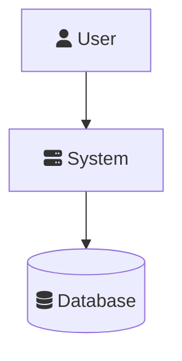
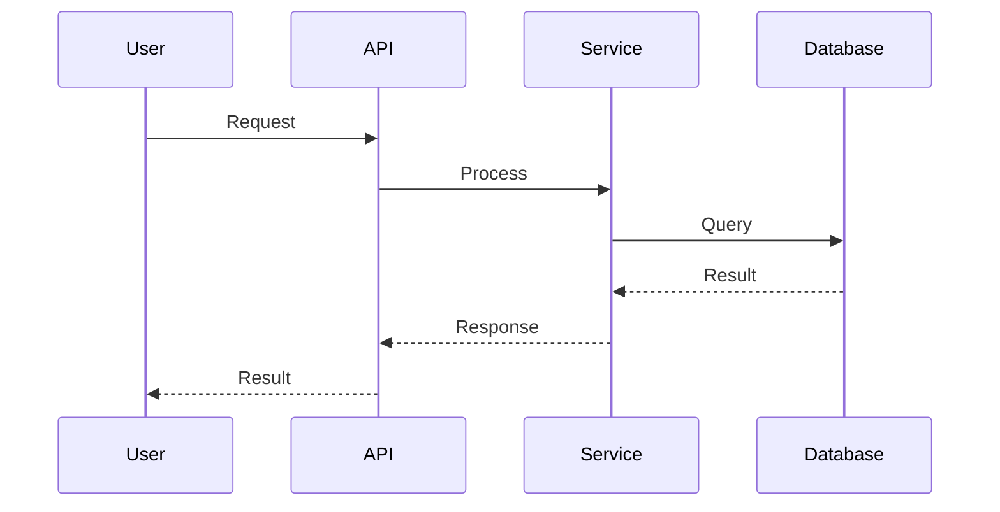
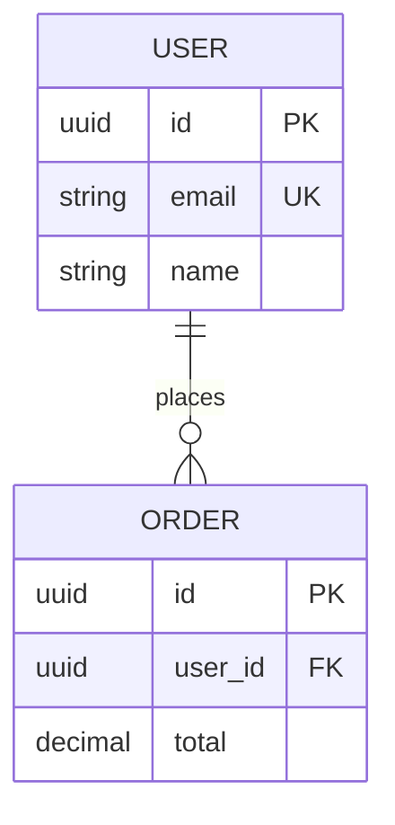
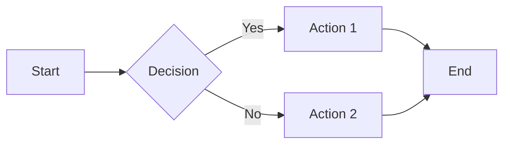

# Architecture Documentation Template

Template for generating architecture documentation. Variables use mustache-style syntax: `{{VARIABLE_NAME}}`.

---

## Template

```markdown
# {{PROJECT_NAME}} Architecture

{{ARCHITECTURE_OVERVIEW}}

## Table of Contents

- [System Overview](#system-overview)
- [Component Architecture](#component-architecture)
- [Data Architecture](#data-architecture)
- [Key Workflows](#key-workflows)
- [Deployment Architecture](#deployment-architecture)
- [Security Architecture](#security-architecture)
- [Technology Decisions](#technology-decisions)

## System Overview

{{SYSTEM_DESCRIPTION}}

### System Context Diagram

```mermaid
graph TB
    subgraph "External Actors"
{{#EXTERNAL_ACTORS}}
        {{ACTOR_ID}}[fa:{{ACTOR_ICON}} {{ACTOR_NAME}}]
{{/EXTERNAL_ACTORS}}
    end

    subgraph "{{PROJECT_NAME}}"
{{#INTERNAL_COMPONENTS}}
        {{COMPONENT_ID}}[fa:{{COMPONENT_ICON}} {{COMPONENT_NAME}}]
{{/INTERNAL_COMPONENTS}}
    end

    subgraph "Data Stores"
{{#DATA_STORES}}
        {{STORE_ID}}[(fa:{{STORE_ICON}} {{STORE_NAME}})]
{{/DATA_STORES}}
    end

{{#CONNECTIONS}}
    {{FROM}} --> {{TO}}
{{/CONNECTIONS}}
```

### External Systems

| System | Purpose | Integration Type |
|--------|---------|------------------|
{{#EXTERNAL_SYSTEMS}}
| {{SYSTEM_NAME}} | {{SYSTEM_PURPOSE}} | {{INTEGRATION_TYPE}} |
{{/EXTERNAL_SYSTEMS}}

## Component Architecture

### High-Level Components

```mermaid
graph TB
{{#COMPONENT_LAYERS}}
    subgraph "{{LAYER_NAME}}"
{{#LAYER_COMPONENTS}}
        {{COMPONENT_ID}}[{{COMPONENT_NAME}}]
{{/LAYER_COMPONENTS}}
    end
{{/COMPONENT_LAYERS}}

{{#COMPONENT_CONNECTIONS}}
    {{FROM}} --> {{TO}}
{{/COMPONENT_CONNECTIONS}}
```

### Component Details

{{#COMPONENTS}}
#### {{COMPONENT_NAME}}

**Purpose:** {{COMPONENT_PURPOSE}}

**Responsibilities:**
{{#RESPONSIBILITIES}}
- {{RESPONSIBILITY}}
{{/RESPONSIBILITIES}}

**Dependencies:**
{{#DEPENDENCIES}}
- {{DEPENDENCY}}
{{/DEPENDENCIES}}

**Key Files:**
- `{{MAIN_FILE}}`
{{/COMPONENTS}}

## Data Architecture

### Entity Relationship Diagram

```mermaid
erDiagram
{{#ENTITIES}}
    {{ENTITY_NAME}} {
{{#ENTITY_FIELDS}}
        {{FIELD_TYPE}} {{FIELD_NAME}} {{FIELD_CONSTRAINT}}
{{/ENTITY_FIELDS}}
    }
{{/ENTITIES}}

{{#RELATIONSHIPS}}
    {{ENTITY_A}} {{RELATIONSHIP_TYPE}} {{ENTITY_B}} : {{RELATIONSHIP_LABEL}}
{{/RELATIONSHIPS}}
```

### Data Flow

```mermaid
flowchart LR
{{#DATA_FLOW_NODES}}
    {{NODE_ID}}[{{NODE_LABEL}}]
{{/DATA_FLOW_NODES}}

{{#DATA_FLOW_CONNECTIONS}}
    {{FROM}} -->|{{LABEL}}| {{TO}}
{{/DATA_FLOW_CONNECTIONS}}
```

### Data Stores

| Store | Type | Purpose | Size Estimate |
|-------|------|---------|---------------|
{{#DATA_STORES_TABLE}}
| {{STORE_NAME}} | {{STORE_TYPE}} | {{STORE_PURPOSE}} | {{SIZE_ESTIMATE}} |
{{/DATA_STORES_TABLE}}

## Key Workflows

{{#WORKFLOWS}}
### {{WORKFLOW_NAME}}

{{WORKFLOW_DESCRIPTION}}

```mermaid
sequenceDiagram
{{#PARTICIPANTS}}
    participant {{PARTICIPANT_ID}} as {{PARTICIPANT_NAME}}
{{/PARTICIPANTS}}

{{#SEQUENCE_STEPS}}
    {{STEP}}
{{/SEQUENCE_STEPS}}
```

**Notes:**
{{#WORKFLOW_NOTES}}
- {{NOTE}}
{{/WORKFLOW_NOTES}}

{{/WORKFLOWS}}

## Deployment Architecture

### Infrastructure Diagram

```mermaid
graph TB
{{#DEPLOYMENT_LAYERS}}
    subgraph "{{LAYER_NAME}}"
{{#LAYER_NODES}}
        {{NODE_ID}}[{{NODE_ICON}} {{NODE_NAME}}]
{{/LAYER_NODES}}
    end
{{/DEPLOYMENT_LAYERS}}

{{#DEPLOYMENT_CONNECTIONS}}
    {{FROM}} --> {{TO}}
{{/DEPLOYMENT_CONNECTIONS}}
```

### Environments

| Environment | URL | Purpose | Scale |
|-------------|-----|---------|-------|
{{#ENVIRONMENTS}}
| {{ENV_NAME}} | {{ENV_URL}} | {{ENV_PURPOSE}} | {{ENV_SCALE}} |
{{/ENVIRONMENTS}}

### Infrastructure Components

| Component | Service | Specifications |
|-----------|---------|----------------|
{{#INFRA_COMPONENTS}}
| {{COMPONENT_NAME}} | {{SERVICE_NAME}} | {{SPECIFICATIONS}} |
{{/INFRA_COMPONENTS}}

## Security Architecture

### Security Layers

```mermaid
graph TB
{{#SECURITY_LAYERS}}
    subgraph "{{LAYER_NAME}}"
{{#LAYER_COMPONENTS}}
        {{COMPONENT_ID}}[{{COMPONENT_NAME}}]
{{/LAYER_COMPONENTS}}
    end
{{/SECURITY_LAYERS}}

{{#SECURITY_CONNECTIONS}}
    {{FROM}} --> {{TO}}
{{/SECURITY_CONNECTIONS}}
```

### Authentication

| Aspect | Implementation |
|--------|----------------|
| Method | {{AUTH_METHOD}} |
| Token Type | {{TOKEN_TYPE}} |
| Token Lifetime | {{TOKEN_LIFETIME}} |
| Storage | {{TOKEN_STORAGE}} |

### Authorization

| Role | Permissions |
|------|-------------|
{{#ROLES}}
| {{ROLE_NAME}} | {{ROLE_PERMISSIONS}} |
{{/ROLES}}

### Security Measures

{{#SECURITY_MEASURES}}
- **{{MEASURE_NAME}}:** {{MEASURE_DESCRIPTION}}
{{/SECURITY_MEASURES}}

## Technology Decisions

### ADR Index

| ID | Title | Status | Date |
|----|-------|--------|------|
{{#ADRS}}
| {{ADR_ID}} | {{ADR_TITLE}} | {{ADR_STATUS}} | {{ADR_DATE}} |
{{/ADRS}}

{{#ADR_DETAILS}}
### {{ADR_ID}}: {{ADR_TITLE}}

**Status:** {{ADR_STATUS}}

**Context:**
{{ADR_CONTEXT}}

**Decision:**
{{ADR_DECISION}}

**Consequences:**

Positive:
{{#ADR_POSITIVE}}
- {{CONSEQUENCE}}
{{/ADR_POSITIVE}}

Negative:
{{#ADR_NEGATIVE}}
- {{CONSEQUENCE}}
{{/ADR_NEGATIVE}}

{{/ADR_DETAILS}}

## Integration Points

### Internal Services

| Service | Protocol | Purpose |
|---------|----------|---------|
{{#INTERNAL_SERVICES}}
| {{SERVICE_NAME}} | {{PROTOCOL}} | {{PURPOSE}} |
{{/INTERNAL_SERVICES}}

### External Integrations

| System | Type | Documentation |
|--------|------|---------------|
{{#EXTERNAL_INTEGRATIONS}}
| {{SYSTEM_NAME}} | {{INTEGRATION_TYPE}} | [Docs]({{DOCS_URL}}) |
{{/EXTERNAL_INTEGRATIONS}}

## Appendix

### Glossary

| Term | Definition |
|------|------------|
{{#GLOSSARY}}
| {{TERM}} | {{DEFINITION}} |
{{/GLOSSARY}}

### References

{{#REFERENCES}}
- [{{REFERENCE_NAME}}]({{REFERENCE_URL}})
{{/REFERENCES}}
```

---

## Variable Reference

### Project Variables

| Variable | Type | Description |
|----------|------|-------------|
| `PROJECT_NAME` | string | Name of the project |
| `ARCHITECTURE_OVERVIEW` | string | High-level architecture description |
| `SYSTEM_DESCRIPTION` | string | Detailed system description |

### Diagram Variables

| Variable | Type | Description |
|----------|------|-------------|
| `EXTERNAL_ACTORS` | array | External users/systems |
| `INTERNAL_COMPONENTS` | array | Internal system components |
| `DATA_STORES` | array | Databases and caches |
| `CONNECTIONS` | array | Relationship arrows |

### Component Variables

| Variable | Type | Description |
|----------|------|-------------|
| `COMPONENT_NAME` | string | Name of component |
| `COMPONENT_PURPOSE` | string | What the component does |
| `RESPONSIBILITIES` | array | List of responsibilities |
| `DEPENDENCIES` | array | Component dependencies |

### Security Variables

| Variable | Type | Description |
|----------|------|-------------|
| `AUTH_METHOD` | string | Authentication method |
| `TOKEN_TYPE` | string | Type of token used |
| `TOKEN_LIFETIME` | string | Token expiration time |
| `ROLES` | array | Role definitions |

### ADR Variables

| Variable | Type | Description |
|----------|------|-------------|
| `ADR_ID` | string | ADR identifier (ADR-001) |
| `ADR_TITLE` | string | Decision title |
| `ADR_STATUS` | string | Proposed/Accepted/Deprecated |
| `ADR_CONTEXT` | string | Problem context |
| `ADR_DECISION` | string | What was decided |

---

## Mermaid Diagram Templates

### System Context


### Sequence Diagram


### ER Diagram


### Flowchart


---

## Icon Reference

### Font Awesome Icons for Diagrams

| Icon | Code | Use For |
|------|------|---------|
| User | `fa:fa-user` | End users |
| Users | `fa:fa-users` | User groups |
| Server | `fa:fa-server` | Backend services |
| Database | `fa:fa-database` | Databases |
| Cloud | `fa:fa-cloud` | Cloud services |
| Lock | `fa:fa-lock` | Security |
| Globe | `fa:fa-globe` | Web/Internet |
| Cogs | `fa:fa-cogs` | Processing |
| Bolt | `fa:fa-bolt` | Cache/Fast storage |
| Shield | `fa:fa-shield` | Security layer |
